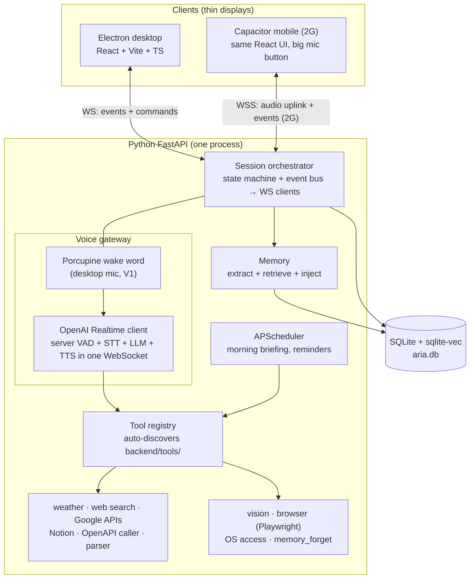
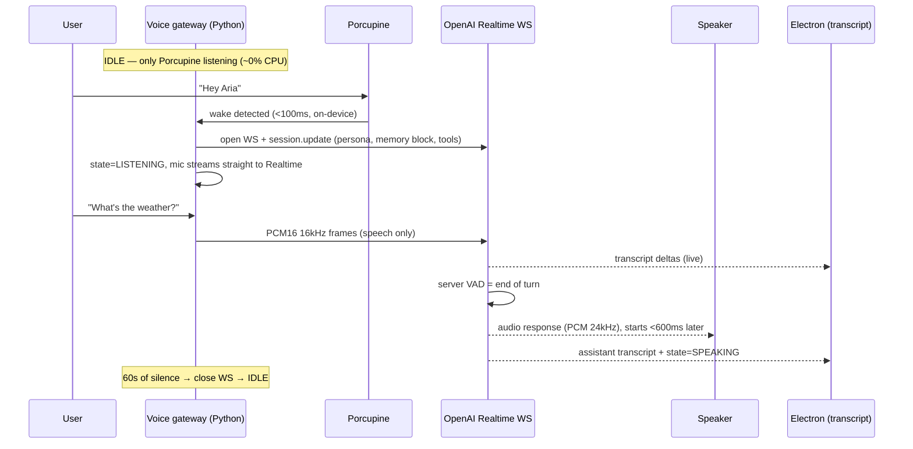
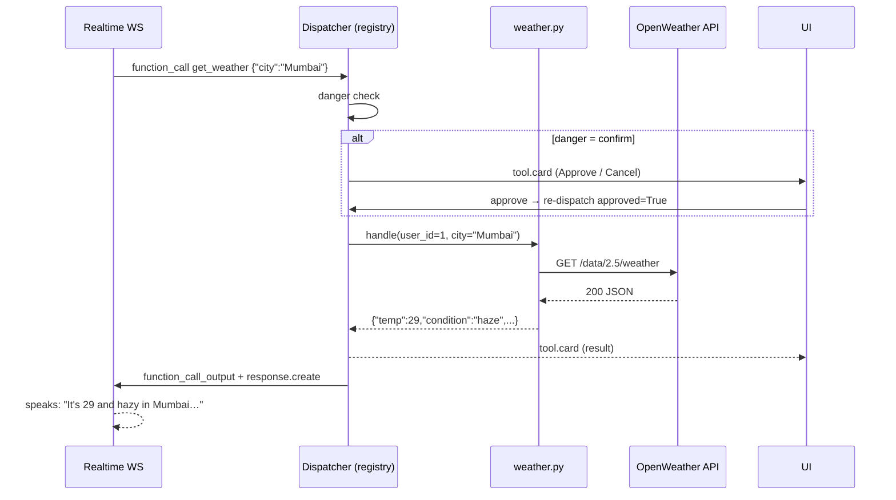
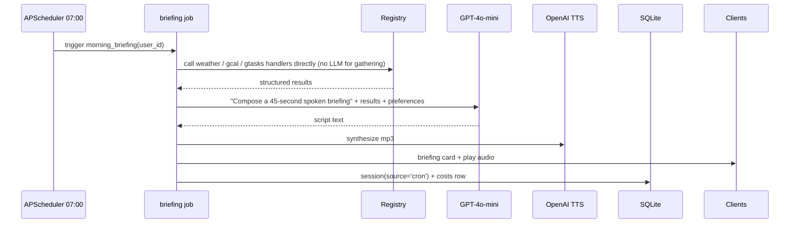
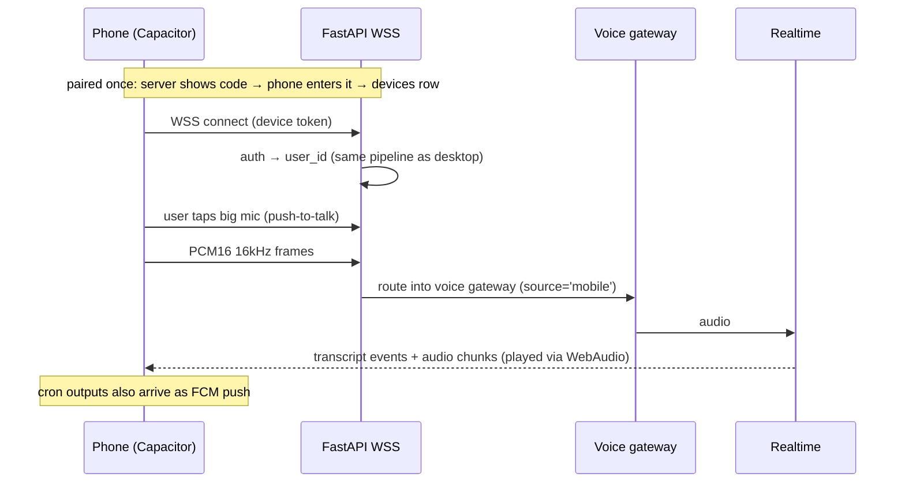
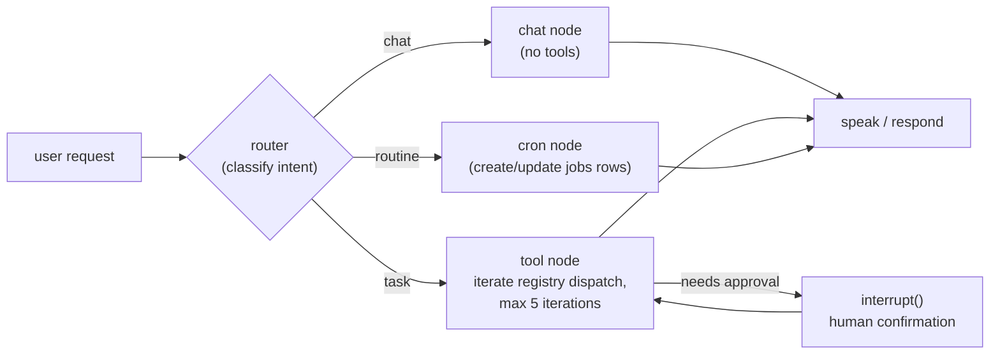

# A.R.I.A. — Master Specification

**Status:** Source of truth for development · v1.0 · 2026-09-15
**Owner:** You. Every deviation from this doc is a decision that gets written back here.

| This section | Extract later into |
|---|---|
| §2 Architecture, §5 Data Model | `ARCHITECTURE.md` |
| §6 Tool Registry | `TOOLS.md` |
| §13 V1, §14 V2 | `ROADMAP.md`, `docs/phases/*.md` |
| §12 SaaS readiness | `SAAS_PLAN.md` |

---

## 1. Executive Summary

A.R.I.A. is a voice-first personal assistant built as one Python FastAPI backend that owns the entire voice pipeline (wake word → realtime speech model → speaker) and all capabilities (tools, memory, scheduler, vision, browser, OS access), with thin display clients — an Electron window today, a Capacitor app later — connected over a local WebSocket. Everything persists in a single SQLite file (plus the sqlite-vec extension for embeddings) with `user_id` columns from day one so multi-tenant SaaS is a retrofit of auth, not a data migration. V1 (1–2 weeks) is only the voice loop proven end-to-end; V2 (4–8 weeks) layers memory, tools, cron, vision, browser, OS access, and mobile in strict order, with LangGraph deferred until a concrete trigger fires. The design rule throughout: one process, one database, one file per capability, no frameworks until a measured need exists.

---

## 2. Architecture Diagram

One backend process. Clients are displays + audio sources. The database is the only store.



**Deliberately not drawn:** the fallback brain (Deepgram STT → GPT-4o → OpenAI TTS). It gets built on demand — the first Realtime outage or genuinely tool-heavy workload is the trigger, not the calendar (§3.1 flag 7).

**Interface contracts**

| Boundary | Contract |
|---|---|
| Client ↔ Backend | One WebSocket. Backend → client: JSON events (`state`, `transcript.partial`, `transcript.final`, `assistant.transcript`, `tool.card`, `error`). Client → backend: commands (`mute`, `stop`, `approve_tool_call`) and, from 2G, PCM16 audio frames. |
| Brain ↔ Tools | OpenAI function-calling schema. The registry emits the same `tools` array to the Realtime session and to GPT-4o/Claude. |
| Anything ↔ Storage | One SQLite file. No second store, ever. |

---

## 3. Tech Stack Table

| Layer | Choice | Verdict | One-line justification |
|---|---|---|---|
| Wake word | Porcupine | Keep | On-device, ~$0 CPU; "aria" needs a free custom keyword (Picovoice Console, ~2 min to train). |
| VAD | Silero VAD | Defer to 2G | Realtime's server VAD already owns turn detection; Silero's upload-gating only pays off once the mic uplink crosses a network (2G mobile). |
| Primary voice loop | OpenAI Realtime API | Keep | STT+LLM+TTS in one socket ≈ sub-second responses; nothing you can assemble from parts beats it on latency. |
| Fallback STT | Deepgram Nova-3 | Keep, built on demand | See flag #1 below — serves the fallback text brain, not the primary loop; build only when a Realtime outage demands it (flag #7). |
| Fallback brain | GPT-4o (default), Claude (option) | Keep, deferred | Trigger is the first Realtime outage or tool-heavy workload, not the calendar (flag #7); GPT-4o shares the function-calling format with Realtime (one dispatcher, one SDK). |
| Database | SQLite + sqlite-vec | Keep | One file, zero ops, and vec-similarity for 100k memories is instant. |
| Desktop shell | Electron | Keep, but optional day 1 | Week 1 can run in a plain browser tab; Electron adds tray, always-on-top overlay, global hotkey — land it by end of V1. |
| Mobile shell | Capacitor | Keep | Reuses the React UI wholesale; native mic + push via plugins. |
| UI | React + Vite + TypeScript | Keep | Fast, boring, shared between desktop and mobile. |
| Backend | Python FastAPI | Keep — do **not** switch to Node | Every audio/voice library in the stack (Porcupine, Silero, Deepgram, sqlite-vec, Playwright, APScheduler) is first-class in Python; Node's only win would be type-sharing with React, not worth losing the ecosystem. |
| Browser automation | Playwright | Keep | Python-first, auto-waiting, one install command. |
| Scheduler | APScheduler | Keep (pin 3.x) | See flag #4 — 4.x is a ground-up rewrite; pin `>=3.10,<4`. |
| Search | Tavily | Keep, over Perplexity | Purpose-built for agents, returns clean structured content, generous free tier; Perplexity is a search-augmented LLM — pricier and less structured per call. |
| Weather | OpenWeather | Keep | Free tier is plenty for personal use. |
| Notes | Notion SDK | Keep | Official client, simple REST. |
| Orchestration | LangGraph (V2H only) | Keep, deferred | Only when the trigger criteria in §9 fire. |
| **Not used** | LangChain, LanceDB, Postgres, vector DBs, other agent frameworks | Confirmed | None earn their complexity at this scale. |

### 3.1 Stack flags — things you asked for that needed correction

1. **Deepgram → Realtime double-STT (the big one).** As originally ordered (Deepgram → transcript → Realtime), you'd pay Realtime audio prices to run it as a text model and add a full network hop to every turn — the `<2s` acceptance target becomes very hard. **Fix:** mic → Porcupine → Realtime directly (Realtime does VAD, STT, reasoning, TTS in one socket). Deepgram is the STT for the fallback brain (§2 `FB`), where a text model genuinely needs a transcript. Everything in your locked stack stays; roles are corrected.
2. **Mic ownership.** The spec wasn't explicit about *who captures audio*. V1: the **Python process owns the mic** (`sounddevice`, WASAPI shared mode on Windows); Electron is display-only. The audio-over-WebSocket protocol is built once, in 2G, for mobile — because the server owns the pipeline there too.
3. **Cost ledger pulled forward to V1.** Realtime is your dominant cost and the #1 risk (§15). The `costs` table lands in V1 (one insert per turn from Realtime usage events); only the *reporting UI* waits for 2I.
4. **Google APIs ordered:** Calendar → Tasks → Gmail (read-only) last. Email is where tool security and prompt-injection risk get serious; don't let it block 2B.
5. **Mobile gets push-to-talk, not wake word.** Porcupine does ship mobile/web SDKs, but PTT matches the "big mic button" UI, avoids battery drain, and ships a week earlier. Wake-on-mobile is a post-V2 option.
6. **Electron can't run on mobile — handled by structure:** all UI lives in `shared-ui/`; Electron and Capacitor are thin shells that load it. No shared component is ever written inside `desktop/`.
7. **V1 trims (this revision).** Silero VAD is out of V1 — Realtime's server VAD owns turn detection, and streaming the occasional second of silence costs less (money and code) than a local VAD module. Silero returns in 2G to gate the mobile audio uplink. The fallback brain (Deepgram → GPT-4o → TTS) is likewise no longer scheduled in 2B: build it the first time a Realtime outage or tool-heavy workload actually bites — it's ~1 day of work from pieces already in the stack.

---

## 4. Project Structure

```
aria/
├── docs/
│   ├── MASTER_SPEC.md            ← this file
│   └── phases/                   ← one checklist per V2 phase, written when the phase starts
├── backend/                      ← Python FastAPI — owns mic, brain, tools, DB
│   ├── core/
│   │   ├── config.py             ← env parsing (pydantic-settings), feature flags
│   │   ├── db.py                 ← SQLite connection (WAL), migrations, vec extension load
│   │   ├── audio.py              ← mic capture 16kHz PCM16 + speaker output 24kHz
│   │   ├── wake.py               ← Porcupine loop
│   │   ├── voice_gateway.py      ← state machine: IDLE→ARMED→LISTENING→SPEAKING→…
│   │   ├── realtime.py           ← OpenAI Realtime WS client (session.update, events)
│   │   ├── events.py             ← async event bus → broadcast to WS clients
│   │   └── tts.py                ← OpenAI TTS (cron briefings; on-demand fallback brain)
│   ├── tools/
│   │   ├── registry.py           ← auto-discovery + dispatcher (§6)
│   │   ├── weather.py            ← example template tool
│   │   ├── web_search.py         ← 2B
│   │   ├── gcal.py / gtasks.py / gmail_read.py   ← 2B, in that order
│   │   ├── notion.py             ← 2B
│   │   ├── openapi_caller.py     ← 2B; spec JSONs live in tools/openapi_specs/
│   │   ├── data_parser.py        ← 2B (PDF/CSV/JSON → text/tables)
│   │   ├── vision.py             ← 2D (screenshot/webcam → GPT-4o vision)
│   │   ├── browser.py            ← 2E (Playwright, allowlisted)
│   │   ├── os_access.py          ← 2F (files/apps/clipboard, rooted + allowlisted)
│   │   └── memory_forget.py      ← 2A
│   ├── memory/
│   │   ├── extract.py            ← session-end extraction (§8)
│   │   └── retrieve.py           ← query embedding + top-k + context block
│   ├── scheduler/
│   │   └── jobs.py               ← APScheduler: morning_briefing, reminders (2C)
│   ├── api/
│   │   ├── ws.py                 ← /ws — events out, commands in (mobile audio in 2G)
│   │   └── rest.py               ← /health, /settings, /pair (mobile device pairing, 2G)
│   ├── auth.py                   ← get_current_user() → user 1 in V1; real auth slots here
│   └── main.py                   ← app assembly, startup: migrations + registry load + scheduler
├── shared-ui/                    ← React + Vite + TS — the ONLY place UI is written
│   └── src/
│       ├── App.tsx               ← voice-first layout: status ring, transcript, cards
│       ├── components/
│       │   ├── Transcript.tsx    ← live rolling transcript
│       │   ├── StatusRing.tsx    ← idle / listening / speaking states
│       │   ├── MicButton.tsx     ← mobile PTT (hidden on desktop)
│       │   ├── ToolCard.tsx      ← weather/calendar/notion results + confirmations
│       │   └── Settings.tsx
│       └── lib/ws.ts             ← typed WS client + event types
├── desktop/                      ← Electron shell only
│   ├── main.js                   ← window, tray, global hotkey; loads shared-ui
│   └── preload.js                ← exposes window.aria (onEvent, approve)
├── mobile/                       ← Capacitor shell only (2G)
│   └── capacitor.config.ts       ← appUrl → built shared-ui; plugins: mic, FCM
├── data/                         ← aria.db (gitignored)
├── scripts/
│   └── soak_test_wake.py         ← 1hr false-wake measurement (V1 acceptance)
├── .env.example
├── claude.md                     ← already present
└── README.md                     ← 10 lines: install, run, talk
```

Rules: no code outside these folders; tools import nothing from each other; `core/` imports `tools/registry.py` and nothing else from `tools/`.

---

## 5. Data Model

One file: `data/aria.db`. WAL mode, `PRAGMA foreign_keys = ON`. Migrations = numbered `.sql` files applied at startup (`db.py`, 30 lines, no Alembic).

### V1 (shipped week 1–2)

```sql
-- Seeded with user 1 ("me") at first run. Auth never touches this table until SaaS.
CREATE TABLE users (
  id INTEGER PRIMARY KEY,
  name TEXT NOT NULL DEFAULT 'me',
  created_at TEXT NOT NULL DEFAULT (datetime('now'))
);

CREATE TABLE sessions (
  id INTEGER PRIMARY KEY,
  user_id INTEGER NOT NULL REFERENCES users(id),
  source TEXT NOT NULL DEFAULT 'desktop',      -- desktop | mobile | cron
  started_at TEXT NOT NULL DEFAULT (datetime('now')),
  ended_at TEXT,
  turn_count INTEGER NOT NULL DEFAULT 0
);

CREATE TABLE turns (
  id INTEGER PRIMARY KEY,
  session_id INTEGER NOT NULL REFERENCES sessions(id),
  user_id INTEGER NOT NULL REFERENCES users(id),
  role TEXT NOT NULL,                          -- 'user' | 'assistant'
  text TEXT NOT NULL,
  t_wake_ms INTEGER,                           -- monotonic stage timestamps (§10)
  t_eot_ms INTEGER,
  t_first_audio_ms INTEGER,
  latency_ms INTEGER,                          -- wake→first audio
  created_at TEXT NOT NULL DEFAULT (datetime('now'))
);

CREATE TABLE costs (                          -- pulled forward from 2I (see §3.1)
  id INTEGER PRIMARY KEY,
  user_id INTEGER NOT NULL REFERENCES users(id),
  day TEXT NOT NULL,                           -- '2026-09-15'
  provider TEXT NOT NULL,                      -- openai_realtime | openai_tts | deepgram | ...
  audio_seconds REAL NOT NULL DEFAULT 0,
  tokens_in INTEGER NOT NULL DEFAULT 0,
  tokens_out INTEGER NOT NULL DEFAULT 0,
  usd_cents REAL NOT NULL DEFAULT 0
);

CREATE TABLE settings (
  user_id INTEGER NOT NULL REFERENCES users(id),
  key TEXT NOT NULL,
  value TEXT NOT NULL,                         -- JSON
  PRIMARY KEY (user_id, key)
);
```

### V2 additions (each lands with its phase)

```sql
-- 2B
CREATE TABLE tool_calls (
  id INTEGER PRIMARY KEY,
  user_id INTEGER NOT NULL REFERENCES users(id),
  turn_id INTEGER REFERENCES turns(id),
  tool_name TEXT NOT NULL,
  args_json TEXT NOT NULL,
  result_json TEXT,                            -- truncated to 4KB
  ok INTEGER NOT NULL,
  duration_ms INTEGER,
  created_at TEXT NOT NULL DEFAULT (datetime('now'))
);

-- 2A — curated memories (distinct from the raw turns log)
CREATE TABLE memories (
  id INTEGER PRIMARY KEY,
  user_id INTEGER NOT NULL REFERENCES users(id),
  kind TEXT NOT NULL,                          -- fact | preference | event
  text TEXT NOT NULL,                          -- one atomic sentence
  importance INTEGER NOT NULL DEFAULT 3,       -- 1..5
  source_turn_id INTEGER REFERENCES turns(id),
  active INTEGER NOT NULL DEFAULT 1,
  created_at TEXT NOT NULL DEFAULT (datetime('now')),
  updated_at TEXT
);

-- 2A — sqlite-vec virtual table; embeddings generated on write/update only
CREATE VIRTUAL TABLE memory_vec USING vec0(
  memory_id INTEGER PRIMARY KEY,
  user_id INTEGER PARTITION KEY,               -- partition key → per-user KNN (sqlite-vec ≥ 0.1.6)
  embedding float[1536]
);

-- 2C
CREATE TABLE jobs (
  id INTEGER PRIMARY KEY,
  user_id INTEGER NOT NULL REFERENCES users(id),
  kind TEXT NOT NULL,                          -- briefing | reminder
  cron_expr TEXT,                              -- for recurring
  run_at TEXT,                                 -- for one-shot reminders
  payload_json TEXT NOT NULL,
  enabled INTEGER NOT NULL DEFAULT 1,
  last_run_at TEXT
);

-- 2B — OAuth tokens live in the OS keyring (Windows Credential Manager) via `keyring`;
-- this table only stores the pointer + scope, so secrets never sit in SQLite.
CREATE TABLE oauth_links (
  id INTEGER PRIMARY KEY,
  user_id INTEGER NOT NULL REFERENCES users(id),
  provider TEXT NOT NULL,                      -- google | notion
  scopes TEXT NOT NULL,
  keyring_key TEXT NOT NULL,
  expires_at TEXT
);

-- 2G — paired mobile devices
CREATE TABLE devices (
  id INTEGER PRIMARY KEY,
  user_id INTEGER NOT NULL REFERENCES users(id),
  device_token_hash TEXT NOT NULL UNIQUE,
  name TEXT,
  last_seen_at TEXT,
  created_at TEXT NOT NULL DEFAULT (datetime('now'))
);
```

**Why this is SaaS-ready without being SaaS:** every row a user could ever own carries `user_id`; every tool handler receives `user_id` as its first argument; `auth.py:get_current_user()` returns user 1 today and swaps to a JWT lookup later without a single other file changing. Adding auth is a new `users`-row-per-customer plus one function body. Nothing else.

---

## 6. Tool Registry Design

**The pattern: convention over registration.** A tool is any file in `backend/tools/` that isn't `_`-prefixed and exposes `TOOL_DEF` + `handle()`. Dropping the file **is** the registration (one step, not two — better than the requested "file + one line"). `registry.py` validates at startup and fails loudly with the offending filename if a tool is malformed, so a typo never silently disables a tool.

```python
# backend/tools/weather.py — the template every tool copies
import httpx
from core.config import settings

TOOL_DEF = {
    "name": "get_weather",
    "description": "Current weather and today's forecast for a city. "
                   "Use for any weather question.",
    "parameters": {
        "type": "object",
        "properties": {
            "city": {"type": "string", "description": "City name, e.g. 'Mumbai'"},
            "units": {"type": "string", "enum": ["c", "f"],
                      "description": "Defaults to the user's preference."}
        },
        "required": ["city"],
    },
    "danger": "safe",        # safe = auto-run | confirm = UI card approval first
    "enabled": True,
}

async def handle(user_id: int, city: str, units: str = "c") -> dict:
    # user_id is ALWAYS the first arg (claude.md rule, SaaS-ready).
    # Return small, plain dicts — they get spoken and rendered as cards.
    r = await httpx.get(
        "https://api.openweathermap.org/data/2.5/weather",
        params={"q": city, "appid": settings.openweather_key, "units":
                "metric" if units == "c" else "imperial"},
        timeout=5,
    )
    r.raise_for_status()
    d = r.json()
    return {
        "city": d["name"],
        "temp": round(d["main"]["temp"]),
        "condition": d["weather"][0]["description"],
        "high": round(d["main"]["temp_max"]),
        "low": round(d["main"]["temp_min"]),
    }
```

```python
# backend/tools/registry.py — complete, ~60 lines, never grows per-tool
import importlib, pkgutil
from typing import Any, Callable
from backend import tools as tools_pkg

class Tool:
    def __init__(self, module_name: str, d: dict, handler: Callable):
        self.module_name = module_name
        self.name = d["name"]
        self.description = d["description"]
        self.parameters = d["parameters"]
        self.danger = d.get("danger", "safe")
        self.enabled = d.get("enabled", True)
        self.handle = handler

_REGISTRY: dict[str, Tool] = {}

def load() -> None:
    for m in pkgutil.iter_modules(tools_pkg.__path__):
        if m.name.startswith("_"):
            continue
        mod = importlib.import_module(f"backend.tools.{m.name}")
        missing = [a for a in ("TOOL_DEF", "handle") if not hasattr(mod, a)]
        if missing:
            raise RuntimeError(f"Tool {m.name}.py missing: {', '.join(missing)}")
        t = Tool(m.name, mod.TOOL_DEF, mod.handle)
        _REGISTRY[t.name] = t        # duplicate names → last import wins; fine, fail loud later if desired

def all_tools() -> list[Tool]:
    return [t for t in _REGISTRY.values() if t.enabled]

def openai_tools_spec() -> list[dict]:
    # The exact shape Realtime session.update and GPT-4o `tools=` both accept.
    return [{"type": "function",
             "name": t.name,
             "description": t.description,
             "parameters": t.parameters} for t in all_tools()]

async def dispatch(name: str, user_id: int, args: dict,
                   approved: bool = False) -> dict:
    t = _REGISTRY.get(name)
    if t is None:
        return {"error": f"unknown tool {name}"}
    if t.danger == "confirm" and not approved:
        return {"needs_confirmation": True, "tool": name, "args": args}
    from core.db import record_tool_call        # single choke point for logging (§5)
    async def run():
        result = await t.handle(user_id, **args)
        return result
    return await record_tool_call(user_id, name, args, run)
```

**How the same registry feeds both brains:**

- **V2B (Realtime):** send `openai_tools_spec()` in `session.update`. When Realtime emits `response.function_call_arguments.done`, the orchestrator calls `dispatch(name, user_id, json.loads(args))`. If the result is `needs_confirmation`, emit a `tool.card` event to the client; the user's **Approve** arrives as a WS command and is re-dispatched with `approved=True`. Otherwise append the result as a `function_call_output` conversation item and trigger `response.create` — the model speaks the answer.
- **2B (fallback brain):** the same `openai_tools_spec()` goes into GPT-4o's `tools=` param; same `dispatch()`, same confirmation gate. One loop, max 4 model→tool iterations, then speak whatever you have.
- **2H (LangGraph):** a tool becomes a graph node with a three-line adapter — **no tool changes**:

```python
def as_node(tool: Tool):
    async def node(state: dict) -> dict:
        result = await tool.handle(state["user_id"], **state["tool_args"])
        return {"tool_results": [result]}
    return node
```

**Guardrails baked into the pattern:** tool results are data, never instructions — they go back to the model as JSON, and a tool result can never auto-approve another `confirm` tool. `tool_calls` logging happens in one place (`record_tool_call`), so cost/latency auditing is automatic.

---

## 7. Message Flow

### (a) Wake → response (the V1 loop)



### (b) Tool call (V2B)



### (c) Cron morning briefing (2C)



Key design choice: the briefing **gathers with direct tool calls, composes with one cheap LLM call** — it never runs an agent loop for a fixed routine.

### (d) Mobile → server request (2G)



---

## 8. Memory Strategy

Three tiers, one database. Raw turns are the audit trail; memories are what gets injected; settings are structured preferences.

| Tier | Table | Written when | Injected? |
|---|---|---|---|
| Raw log | `turns` | every utterance, verbatim | Never (too noisy, grows forever) |
| Memories | `memories` + `memory_vec` | extracted at **session end** (not per turn — cheaper, better context) + instantly via "remember that…" tool (2B) | Yes |
| Preferences | `settings` (e.g. `units=c`, `timezone=Asia/Kolkata`, `briefing_time=07:00`) | user says a durable preference → extractor flags `kind=preference` → upsert | Always (top 3, verbatim) |

**Extraction (2A).** At session end, the full transcript goes to GPT-4o-mini with a strict prompt: return JSON `{kind, text, importance}` items; each `text` one atomic third-person sentence ("User's sister is named Mira"); skip anything ephemeral (weather questions, one-off math). Dedupe before insert: embed candidate, KNN against `memory_vec` for that user — cosine ≥ 0.92 → **update** the existing memory (re-embed) instead of inserting.

**Retrieval rules (per user turn).**

```sql
SELECT m.id, m.text, m.kind, v.distance
FROM memory_vec v JOIN memories m ON m.id = v.memory_id
WHERE v.embedding MATCH :query_embedding AND v.k = 5
  AND v.user_id = :user_id              -- partition key filter
  AND m.active = 1
ORDER BY v.distance;
-- keep rows with distance ≤ 0.70 (≈ cosine ≥ 0.30), then UNION the top-3 preferences
```

**Context injection.** One block, capped at ~800 tokens, placed in the Realtime `session.update` instructions (and the fallback brain's system prompt), refreshed only when its content changes — not per turn:

```
ABOUT THE USER
- Preferences: {top-3 settings as sentences}
- Relevant memories: {top-5 retrieved, most relevant first}
- Today is Tuesday 15 Sep 2026, Asia/Kolkata.
```

**When embeddings are created:** on memory insert, on memory update, and one query embedding per user turn (`text-embedding-3-small`, 1536 dims — fractions of a cent per day). Nothing else embeds; raw `turns` are never vectorized.

**Forgetting:** `memory_forget` tool (2A) — "A.R.I.A., forget that…" → embed query → top match shown as a confirm card → `active = 0` (soft delete; real delete in the SaaS GDPR story). No auto-expiry.

---

## 9. LangGraph Introduction Criteria (V2H)

**Do not install LangGraph until one of these four signals fires. Two signals firing at once = install immediately; any single one = install that week.**

| # | Signal | How you'll observe it |
|---|---|---|
| 1 | **> 8 tools registered** | Function-calling accuracy degrades (model picks wrong tool or hallucinates args) — watch `tool_calls.ok` rate drop below ~90%. |
| 2 | **First real multi-step task** | A request that needs ordered steps with intermediate failure handling ("find flights, compare 3, draft a summary into Notion") where the 4-iteration V2B loop demonstrably isn't enough. |
| 3 | **First human-in-the-loop checkpoint mid-flow** | A flow that must pause for confirmation *and resume later* (minutes/hours, not seconds — the current confirm card handles seconds). |
| 4 | **Observed need to replan after tool failure** | Real logged cases where a failed tool should change the plan, not just be reported. |

If after 2B–2G none have fired, **skip 2H entirely** — that is a success, not a delay.

**Minimal first graph when triggered** (state in the same SQLite file via `SqliteSaver`, tables `graph_*`):



State: `{user_id, messages, tool_args, tool_results, pending_confirmation}`. The registry API (`openai_tools_spec`, `dispatch`, `as_node`) carries over unchanged — that's the payoff of §6.

---

## 10. Latency Budget

Acceptance: **wake → first word of spoken answer < 2.0s** (primary path). Budget per stage:

| Stage | Target | Measured by |
|---|---|---|
| Porcupine wake detect | < 100 ms | timestamp at callback |
| Realtime WS open (cold) | < 400 ms | one-time; mitigated by pre-warm |
| Realtime WS open (warm/pooled) | < 50 ms | default after first session |
| Speech end → end-of-turn (server VAD) | 300–500 ms | `t_eot` event |
| EOT → first audio byte out | < 600 ms | `t_first_audio` |
| **Total (warm)** | **~0.9–1.2 s** | `turns.latency_ms` |
| Fallback path (Deepgram → GPT-4o → TTS) | 2.5–4.0 s | built on demand (§3.1 flag 7) |

**How to measure:** `voice_gateway.py` stamps monotonic clocks at wake / EOT / first-audio into `turns` (§5). `python -m backend.core.stats` prints p50/p95 for the last 20 turns. No other benchmarking infrastructure — this is a personal project, not an SRE org.

**Latency rules baked into design:** Realtime session is pre-warmed on wake (not on speech start); mic frames go straight through (no local buffering); the assistant starts speaking on the first audio delta (streaming, never waits for full response); tool results stream into the same response when possible.

---

## 11. Security & Privacy

**API keys**

- V1: `.env` (gitignored), `.env.example` committed. Personal OpenAI/Deepgram/Picovoice keys are low-blast-radius; don't over-engineer.
- 2B: Google/Notion **OAuth refresh tokens go to the OS keyring** (`keyring` → Windows Credential Manager). SQLite stores only `oauth_links` pointers (§5). Never log keys; never put them in tool results.

**Tool danger model** (enforced in `dispatch()`, not per tool)

| Level | Behavior | Examples |
|---|---|---|
| `safe` | auto-run, logged | weather, search, calendar read, parser |
| `confirm` | UI card, explicit Approve per call | calendar *write*, Notion *write*, clipboard set, any browser action beyond read-only navigation |
| blocked | not a tool at all | arbitrary shell/subprocess, password entry, file delete outside sandbox |

**Browser automation (2E):** allowlist in `settings` (`allowed_domains`); `http://`, `file://`, localhost, and private IP ranges are hard-denied; every navigation logged to `tool_calls`; the agent never types into password/OTP fields (Playwright script checks input type and refuses); purchases and form submissions are `confirm`.

**OS access (2F):** fixed function set only — `read_file` / `write_note` (sandboxed to chosen roots, default `~/Documents/aria`), `open_app` (hard allowlist: chrome, spotify, …), `clipboard_get` / `clipboard_set` (set is `confirm`). **No shell tool exists. Not in V2, not ever.**

**Prompt injection:** tool results and page content are data, framed as such in the model context; a tool result can never approve another tool; browser page content never triggers tools directly.

**Mic & data:** mic indicator always visible in the UI (status ring is honest about state); raw audio is not persisted by default (config flag); transcripts stay in local SQLite; the only network traffic is model-provider API calls + the tools you invoke.

**Network:** desktop binds `127.0.0.1`. Mobile (2G) binds LAN + device token auth (random 32-byte token, stored hashed, paired once via code); remote access = Tailscale, not a public endpoint.

---

## 12. SaaS Readiness Checklist

| Now (V1–V2, structural only) | Deferred (build when there's a second user) |
|---|---|
| `user_id` on every table and every tool handler | Auth (slot ready: `auth.py:get_current_user()` returns user 1; swap body to JWT/OAuth) |
| `costs` ledger per user per day (from V1) | Billing/Stripe (slot ready: usage is already metered per user) |
| `settings` keyed by user | Rate limits per tenant (slot ready: `dispatch()` is the single choke point) |
| Session `source` tagging (desktop/mobile/cron) | Per-tenant encrypted API keys (replace `.env` reads with DB + Fernet) |
| Thin clients over one WS protocol | Admin dashboard, onboarding, data export/delete (GDPR) — `memory_forget` + `users` delete covers the awkward part |
| No global user state anywhere in `core/` | Multi-region/backup story |
| Single-DB multi-tenancy via partition-keyed vec search | Postgres migration — **only if** write concurrency actually demands it; SQLite over Litestream/Durable Object is likely fine for years |

The test of "SaaS-ready shape": adding user #2 in dev must require only `INSERT INTO users` + auth stub change — zero schema or tool changes. Audit that at 2I.

---

## 13. V1 Milestones (2 weeks, proof of life)

Scope guard: **no tools, no memory, no mobile, no LangGraph.** If a V2 idea appears mid-V1, it goes in this doc's §14, not the codebase.

| Milestone | Days | Deliverable | Acceptance criteria |
|---|---|---|---|
| M1 — Skeleton | 1 | Repo per §4; venv; `.env`; FastAPI boots; SQLite migrations run; WS echo works; shared-ui renders in browser tab | `uvicorn backend.main:app` up; `/health` 200; UI connects to WS and prints events |
| M2 — Audio I/O | 1–2 | `audio.py`: mic 16kHz capture + speaker 24kHz playback (sounddevice/WASAPI) | Record 5s, play it back, clean audio on Windows |
| M3 — Wake word | 1 | `wake.py` Porcupine loop with custom "aria" keyword (train free in Picovoice Console, download `.ppn`); wake → event on WS | Say "Hey Aria" 10× → 10 wake events; typing/TV noise → 0 wakes in 10 min |
| M4 — Realtime loop | 2 | `realtime.py`: session open on wake, stream mic audio, play response deltas; conversation window (60s) | "Hey Aria, what's the weather?" → **spoken answer < 2s**; 5-turn follow-up conversation works |
| M5 — UI transcript | 1 | Electron (or browser tab) shows state ring + live transcript + assistant reply | Full convo visible in UI; states idle/listening/speaking correct |
| M6 — Persistence | 0.5 | `sessions`, `turns`, `costs` rows written (Realtime usage events → costs) | 20-command session → 1 session row, 40 turn rows, costs > 0 |
| M7 — Soak + tune | 1 | `scripts/soak_test_wake.py`: 1 hr ambient audio (music/TV) → count false wakes; tune sensitivity | **< 1 false wake/hr**; 20 consecutive commands, zero crashes, memory stable |
| M8 — Polish | 0.5 | README (10 lines), start script, error path: Realtime disconnect → friendly spoken error + reconnect | Kill network mid-session → recovers or fails gracefully |

**V1 done = M3+M4+M6+M7 acceptance all green.** Commit after every milestone (per `claude.md`).

---

## 14. V2 Roadmap (4–8 weeks, strict order)

| Phase | Ships | Depends on | Acceptance |
|---|---|---|---|
| **2A Memory** (1 wk) | `memories` + `memory_vec`, session-end extraction, retrieval injection, `memory_forget` | V1 | Tell it your sister's name → next session "what's my sister's name?" answers correctly; repeated facts dedupe (row count doesn't grow) |
| **2B Tools** (1–2 wk) | `registry.py` + Realtime function calling + confirm cards; tools: weather → web_search → gcal → gtasks → gmail_read → notion → openapi_caller → data_parser | V1 (2A not required) | "What's on my calendar tomorrow?" → spoken correct answer; a Notion write demands a confirm card; each tool has a test (per `claude.md`) |
| **2C Cron** (3–4 d) | APScheduler: morning briefing, one-shot reminders, jobs table | 2B | 07:00 briefing plays with real weather/calendar/tasks; "remind me at 3pm" fires |
| **2D Vision** (3–4 d) | `vision.py` tool: `mss` screenshot / webcam frame → GPT-4o vision → spoken answer | 2B | "What's on my screen?" → correct spoken description; OCR of a screenshot works |
| **2E Browser** (1 wk) | `browser.py`: Playwright, domain allowlist, read-only default, confirm for forms | 2B + confirm cards | "Check the top story on BBC News" reads it aloud; non-allowlisted domain refused; form submit requires Approve |
| **2F OS access** (3–4 d) | `os_access.py`: read_file/write_note (rooted), open_app (allowlist), clipboard | 2B | "Open Spotify" works; `C:\Windows\System32\...` read refused; no shell tool exists (grep proves it) |
| **2G Mobile** (1–2 wk) | Capacitor shell + shared-ui, WSS audio uplink (PTT, Silero upload-gating lives here), device pairing, cards, FCM push | 2B/2C (server pipeline already client-agnostic) | Phone on LAN: hold mic → question → spoken answer in < 2.5s; cron pushes a notification |
| **2H LangGraph** | Only when §9 criteria fire | 2B | First graph: router → chat/tool/cron with SqliteSaver; all existing tools work as nodes unchanged |
| **2I SaaS prep** (1 wk) | Multi-tenant audit (grep: no table/handler without user_id), cost report UI, config abstraction, create-user-2 dev test | all | Adding user 2 requires zero schema changes; per-user cost report renders |

Parallelization: 2A/2B can overlap; 2D–2F are independent after 2B; 2G needs the server but not 2D–2F.

---

## 15. Risks & Mitigations (ranked)

| # | Risk | L×I | Mitigation |
|---|---|---|---|
| 1 | **Realtime API cost overrun** — the dominant line item | M×H | `costs` table from V1; session caps in settings; switch to `gpt-realtime-mini` (≈10× cheaper) after quality benchmark (§Appendix) |
| 2 | **Realtime API outage/limits** — single point of failure for the whole loop | M×H | Accepted until it happens: failure mode is a spoken "voice service is down" error + auto-retry; the fallback brain (Deepgram → GPT-4o → TTS, ~1 day of work) gets built the first time this actually bites (§3.1 flag 7) |
| 3 | **Windows audio stack pain** — WASAPI device switching, sample-rate mismatches | M×M | M2 is a dedicated milestone with its own acceptance; one audio module owns all device handling |
| 4 | **Echo/bleed: assistant hears itself on speakers** | H×M | V1: mute mic during SPEAKING (no AEC); document headphones as best experience; Realtime's turn detection tuned via session params. True barge-in needs AEC — defer |
| 5 | **Scope creep — V2 features leaking into V1** | H×M | This doc is the scope; each phase gets a `docs/phases/` checklist written only when it starts; `claude.md` restates current phase |
| 6 | **False wakes in ambient noise** | M×M | Porcupine sensitivity tuning + M7 soak test with real room noise; the 60s follow-up window bounds open-mic streaming cost |
| 7 | **Playwright fragility on target sites** (selector rot, bot detection) | M×M | Keep browser tool narrow (read-only news/prices on allowlisted domains); log every failed selector to fix fast |
| 8 | **Google OAuth setup swallows a week** | M×M | Calendar first (simplest scope), OAuth client in "testing" mode is fine for personal use; Gmail read-only last |
| 9 | **sqlite-vec edge cases** (extension load on Windows, filter syntax) | L×M | Pin version, load-path in one function in `db.py`, tiny smoke test at M1; fallback = plain cosine in Python (fine at personal scale) |
| 10 | **Multi-tenant retrofit pain** from a missed `user_id` | L×M | claude.md rule (every handler takes user_id first); 2I audit greps for violations; `get_current_user()` stub makes violations compile-errors once real auth lands |

---

## 16. Open Questions (decide by the milestone noted)

1. **Always-on host?** Cron briefings and mobile usefulness assume the server is up when you're not at the desk. Options: leave the dev machine on / a mini-PC / Raspberry Pi (CPU is fine — no local inference except VAD). Decide by 2C.
2. **Realtime model tier:** start `gpt-4o-realtime`/`gpt-realtime` for the quality bar, then A/B `gpt-realtime-mini` (≈10× cheaper)? Decide by end of V1 — the answer changes the cost model. *(Verify current model names/pricing at build time.)*
3. **Tavily vs Perplexity:** recommend Tavily (§3); confirm after 20 real searches in 2B.
4. **iOS at 2G?** Android + FCM is free and unblockable; iOS push needs an Apple dev account ($99/yr) and Capacitor mic-permission plumbing. Recommend Android-first. Decide by 2G start.
5. **Raw audio retention:** default is not stored. If you want playback/audit of what was heard, that's a storage+privacy decision — decide by 2A.
6. **Remote (outside-LAN) mobile access:** Tailscale (recommended, zero infra) vs public WSS + TLS. Decide by 2G.
7. **SaaS key model:** user-brings-own-keys (BYOK — recommended first; kills your cost risk) vs platform keys + metered billing. No deadline — but it shapes `oauth_links`/`costs`, so don't contradict them.
8. **Fallback brain default:** recommend GPT-4o (same SDK/format as Realtime); Claude remains a config flip. Decide when the on-demand trigger fires (§3.1 flag 7), not before.

---

## 17. Appendix

### 17.1 Recommended libraries (pin at install; verify latest stable)

**Python (3.12+)**

| Package | Version | For |
|---|---|---|
| `fastapi` / `uvicorn[standard]` | ≥0.115 / ≥0.30 | API + WS server |
| `openai` | ≥1.50 | Realtime WS, GPT-4o, embeddings, TTS |
| `deepgram-sdk` | ≥4.x | fallback STT — built on demand (§3.1 flag 7) |
| `pvporcupine` | ≥3.x | wake word (needs `PICOVOICE_ACCESS_KEY`) |
| `silero-vad` | ≥5.x | VAD — 2G only (mobile upload-gating) |
| `sounddevice` / `numpy` | ≥0.5 / ≥2.x | audio I/O (WASAPI on Windows) |
| `sqlite-vec` | ≥0.1.6 | vector search extension |
| `apscheduler` | **≥3.10,<4** | cron (4.x is a rewrite — don't) |
| `httpx` | ≥0.27 | async HTTP in tools |
| `playwright` | ≥1.45 | browser automation |
| `notion-client` | ≥2.x | Notion |
| `google-api-python-client`, `google-auth-oauthlib` | latest | Calendar/Tasks/Gmail |
| `mss`, `opencv-python` (2D) | latest | screen/webcam capture |
| `keyring` | ≥25.x | OS keychain for OAuth tokens |
| `pydantic-settings` | ≥2.x | config |
| `pytest`, `pytest-asyncio` | latest | tool tests (claude.md rule) |

**JS (shared-ui / shells)**

| Package | Version | For |
|---|---|---|
| `react`, `react-dom`, `typescript`, `vite` | 18 / 5.x / 6.x | shared UI |
| `electron` | ≥33 | desktop shell |
| `@capacitor/core`, `@capacitor/cli`, `@capacitor/android` | 6.x | mobile shell |
| `@capacitor-community/...` mic + `@capacitor/push-notifications` | latest | 2G mic + FCM |

### 17.2 Environment variables (`.env.example`)

```bash
# Providers
OPENAI_API_KEY=
DEEPGRAM_API_KEY=
PICOVOICE_ACCESS_KEY=            # free at console.picovoice.ai
TAVILY_API_KEY=                  # 2B
OPENWEATHER_API_KEY=             # 2B
NOTION_TOKEN=                    # 2B
GOOGLE_CLIENT_ID=                # 2B (OAuth; refresh token lives in OS keyring)
GOOGLE_CLIENT_SECRET=

# A.R.I.A.
ARIA_DB_PATH=./data/aria.db
ARIA_HOST=127.0.0.1            # 0.0.0.0 only when mobile lands (2G)
ARIA_PORT=8741
ARIA_DEVICE_TOKEN=             # 2G pairing secret
ARIA_REALTIME_MODEL=gpt-4o-realtime-preview
ARIA_BRAIN_MODEL=gpt-4o        # fallback brain; 'claude' also supported
ARIA_EMBED_MODEL=text-embedding-3-small
ARIA_WAKE_SENSITIVITY=0.6
ARIA_FOLLOWUP_WINDOW_S=60
ARIA_LOG_LEVEL=INFO
```

### 17.3 Monthly cost estimate (personal use, ~20 active conversation-min/day — verify current pricing before relying on this)

| Item | Est. $/mo | Notes |
|---|---|---|
| OpenAI Realtime (primary loop) | **$60–180** | ~$0.10–0.30 per active conversation minute; the dominant cost and lever #1 |
| ↳ same usage on `gpt-realtime-mini` | $10–30 | A/B after V1; likely the standing choice |
| GPT-4o fallback + GPT-4o-mini memory/briefing | $5–15 | |
| OpenAI TTS (cron + fallback) | $2–5 | |
| Embeddings (3-small) | < $1 | |
| Deepgram Nova-3 (fallback STT) | < $2 | |
| Tavily | $0–30 | free tier 1,000 searches/mo first |
| OpenWeather / Notion | $0 | free tiers |
| Picovoice Porcupine | $0 personal | **Commercial license required for SaaS** — get a quote before launch, budget line item |
| **Total (personal)** | **~$70–230** | drops to **~$25–80** on mini-realtime |

**Cost levers, in order of impact:** mini-realtime model → shorter follow-up window (less billed idle) → mini tier for briefing composition → Tavily free tier.

---

*End of spec. When reality disagrees with this document, change the code or change the document — never neither.*
